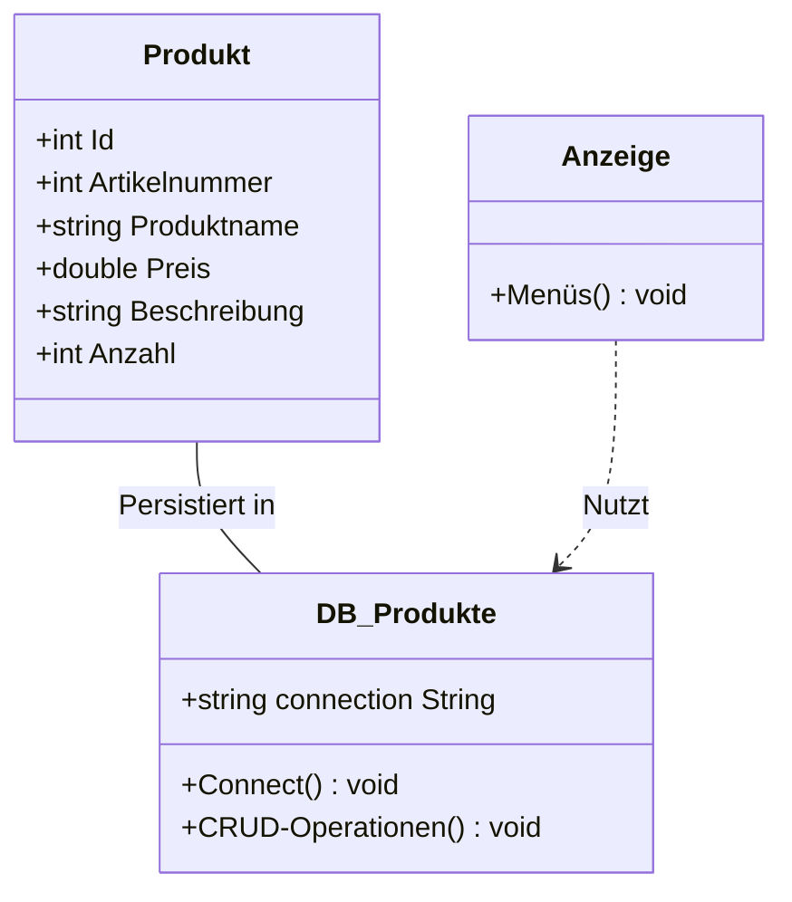
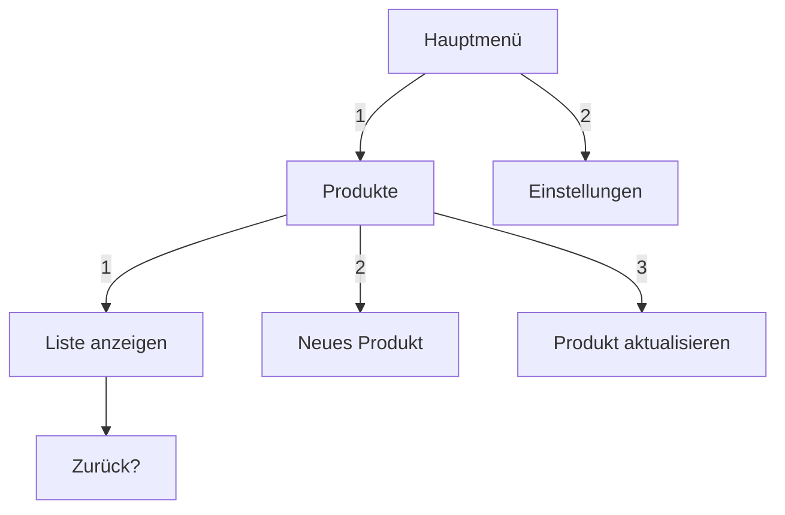

# OnlineShop Database Management (C# / MySQL)

#### 📝 **Kurzbeschreibung**: 
Eine C#-Konsolenanwendung zur Verwaltung von Produkten in einer MySQL-Datenbank mit vollständigen CRUD-Operationen.

---

## 🚀 Kernfunktionen
- **Produktverwaltung** (Create, Read, Update, Delete)
- **Konsolenbasiertes Menüsystem**
- **MySQL-Anbindung** mit Prepared Statements
- **Objektorientiertes Design**

---

## 🏗️ Architektur (Mermaid)

---

# 📦 Installation
### 1. Datenbank einrichten:
```sql

CREATE DATABASE onlineshop;
CREATE TABLE produkte (
    id INT AUTO_INCREMENT PRIMARY KEY,
    artikelnummer INT NOT NULL,
    produktname VARCHAR(255) NOT NULL,
    preis DECIMAL(10,2) NOT NULL,
    beschreibung TEXT,
    anzahl INT NOT NULL
);
```
### 2. Projekt konfigurieren:
#### - Verbindungsstring in DB_Produkte.cs anpassen:

```csharp
public static string connectionString = "Server=localhost; Database=onlineshop; User=root; Password=;";
```
---
# 🛠️ Nutzung
### Menüfluss (Mermaid)


### Beispiel-Interaktion

```bush
# Bei Ausführung:
Main Menu > 1 (Produkte) > 1 (ReadAll)
# Ausgabe:
ID: 1 | Artikelnummer: 1001 | Produktname: Laptop | Preis: 999.99 | Beschreibung: High-End | Anzahl: 10
```
---

# 📊 Datenmodell

|Feld	|Typ	|Beschreibung|
|------|-----|------------|
|id	|INT |(PK)	Autom. ID|
|artikelnummer	|INT	|Eindeutige Produktnummer|
|produktname	|VARCHAR(255)	|Produktbezeichnung|
|preis	|DECIMAL	|Preis mit 2 Dezimalstellen|
|beschreibung	|TEXT	|Detaillierte Beschreibung|
|anzahl	|INT	|Lagerbestand|

---
# 🤝 Beitrag
1. Fork das Repository
2. Erstelle einen Feature-Branch (git checkout -b feature/NeueFunktion)
3. Committe deine Änderungen (git commit -m 'Add feature')
4. Pushe den Branch (git push origin feature/NeueFunktion)
5. Öffne einen Pull Request

---
# Danke!
